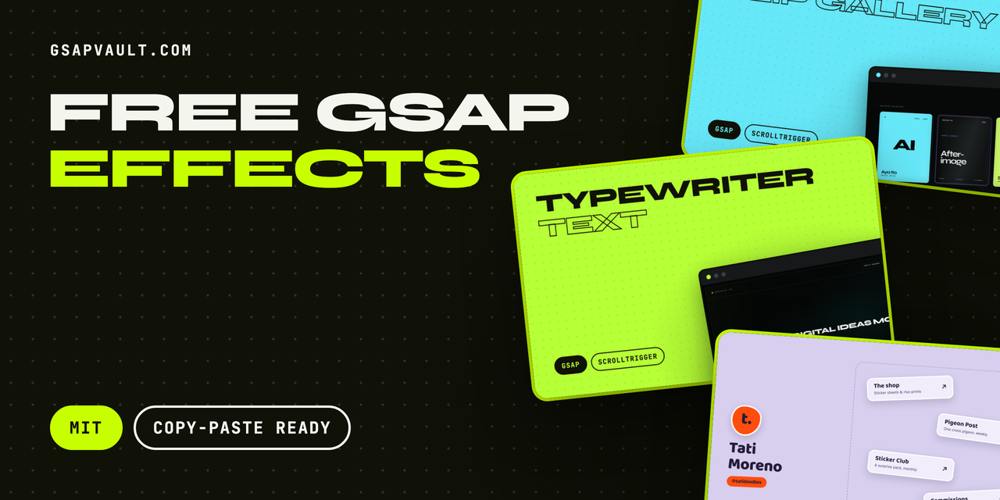

# Free GSAP Effects



Eight free, production-ready GSAP animation effects and four complete website templates. Copy, paste, and ship. Everything is self-contained, framework-agnostic, accessible, and memory-safe.

From [GSAP Vault](https://gsapvault.com), a library of 61 copy-paste GSAP animation effects and 53 complete website templates.

## The Effects

| Effect | What it does | Live demo |
|--------|--------------|-----------|
| [3D Card Flip Gallery](./3d-card-flip) | Tactile 3D cards with deep perspective, reactive edge-light, shadow inversion, hover/focus parity, and tap auto-close. | [Demo](https://gsapvault.com/effects/3d-card-flip) |
| [Scroll Progress Indicator](./scroll-progress) | A precise GSAP reading-progress instrument with bar, ring, side rail, percentage, and active chapter feedback. | [Demo](https://gsapvault.com/effects/scroll-progress) |
| [Typewriter Text](./typewriter-text) | A sharp terminal-style typewriter that types, holds, accelerates through deletion, and cycles to the next phrase in sync with cursor and progress signals. | [Demo](https://gsapvault.com/effects/typewriter-text) |
| [Parallax Hero](./parallax-hero) | A pinned hero that separates its background photograph, copy, and foreground card into distinct scroll depths from a single scrubbed ScrollTrigger. | [Demo](https://gsapvault.com/effects/parallax-hero) |
| [Image Clip Reveal](./image-clip-reveal) | A cinematic image reveal where a directional polygon aperture opens as the photograph settles from a restrained Ken Burns scale and its editorial caption lands. | [Demo](https://gsapvault.com/effects/image-clip-reveal) |
| [Hover Underline](./hover-underline) | Three material link underlines (an exit-through line, marker sweep, and hand-drawn wave) with coordinated type and active-index responses. | [Demo](https://gsapvault.com/effects/hover-underline) |
| [Scroll Text Highlight](./scroll-text-highlight) | A scrubbed orange-to-lime reading front lifts each active word before completed copy settles to white and unread copy remains ghosted. | [Demo](https://gsapvault.com/effects/scroll-text-highlight) |
| [CSS Scroll Reveal](./css-scroll-reveal) | Native CSS scroll-driven reveals for crisp fade, slide, and scale entrances with accessible static fallbacks and no animation JavaScript. | [Demo](https://gsapvault.com/effects/css-scroll-reveal) |

## The Templates

Complete single-purpose web pages, not just isolated effects: open `index.html` and you have a finished site to reskin. Same folder structure as the effects.

| Template | What it is | Live demo |
|--------|--------------|-----------|
| [Coming Soon Template](./coming-soon-template) | A free single-screen holding page dressed as a picture house: a projector beam rakes across a dark auditorium, a house light wanders the room, and the countdown is an Academy leader whose sweep hand turns continuously while the day count cuts once a day. | [Demo](https://gsapvault.com/templates/coming-soon-template) |
| [Charity Campaign Template](./charity-campaign-template) | A free one-page river-restoration appeal built around a draggable before/after comparator: a gauge-board divider wipes between the degraded and the restored river, and every figure on the page counts like a reading. | [Demo](https://gsapvault.com/templates/charity-campaign-template) |
| [Link in Bio Template](./link-in-bio-template) | A free creator profile page whose link cards toss onto the page like stickers landing on a desk, drag anywhere with momentum, and tween back into a neat stack on 'Tidy up' - while a tap always just opens the link. | [Demo](https://gsapvault.com/templates/link-in-bio-template) |
| [QR Table Menu Template](./qr-menu-template) | A phone-first digital menu made to open from a QR code at the table, with a sticky category bar that crossfades between sections and dietary chips that filter every dish at once. | [Demo](https://gsapvault.com/templates/qr-menu-template) |

## Quick Start

Every folder contains:

```
effect-name/
├── index.html        # Working demo page, open it in a browser
├── README.md         # Full documentation: options, examples, accessibility
└── assets/
    ├── style.css     # Styles
    ├── script.js     # Commented source
    └── script.min.js # Minified production build
```

1. Open the folder's `index.html` in a browser to see it working.
2. Read its `README.md` for the copy-paste quick start and all options.
3. Copy the markup pattern and the script into your project. GSAP loads from CDN:

```html
<script src="https://cdn.jsdelivr.net/npm/gsap@3.14.2/dist/gsap.min.js"></script>
<script src="https://cdn.jsdelivr.net/npm/gsap@3.14.2/dist/ScrollTrigger.min.js"></script>
```

## What "production-ready" means here

- **Accessibility built in**: every effect respects [`prefers-reduced-motion`](https://developer.mozilla.org/en-US/docs/Web/CSS/@media/prefers-reduced-motion) with a static fallback, and keyboard focus mirrors hover interactions.
- **Memory-safe**: `gsap.context()` scoping, `gsap.matchMedia()` for responsive and motion branches, event handlers tracked for cleanup, ScrollTriggers killed on teardown.
- **Framework-agnostic**: plain HTML/CSS/JS that drops into WordPress, Webflow, React, Vue, Astro, or static sites. The [GSAP Vault getting started guide](https://gsapvault.com/getting-started) covers framework integration patterns.
- **LLM-friendly**: clearly commented code that AI assistants can read, explain, and adapt for your project.

## Want more?

This repo is the free tier of [GSAP Vault](https://gsapvault.com). The full library has 61 effects and 53 templates, including scroll-image sequences, infinite marquees, draggable galleries, text scramble/decode, magnetic cursors, particle systems, and complete portfolio, restaurant, and SaaS landing templates.

- Browse everything: [gsapvault.com/effects](https://gsapvault.com/effects) and [gsapvault.com/templates](https://gsapvault.com/templates)
- All of it, one payment: [Effects & Templates Vault](https://gsapvault.com/effects), a one-time bundle covering every current and future effect and template, unlimited commercial projects. Check the site for current pricing
- Tutorials and guides: [gsapvault.com/blog](https://gsapvault.com/blog)

## License

Everything in this repository is MIT licensed: use it in personal and commercial projects, no attribution required (a link back to [gsapvault.com](https://gsapvault.com) is always appreciated).

GSAP itself is created by Greensock/Webflow and is [100% free](https://gsap.com/pricing/) including all plugins.
